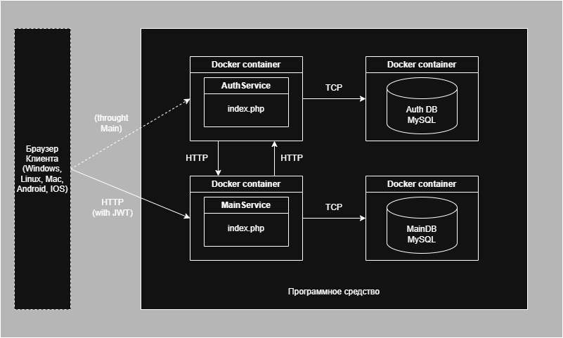
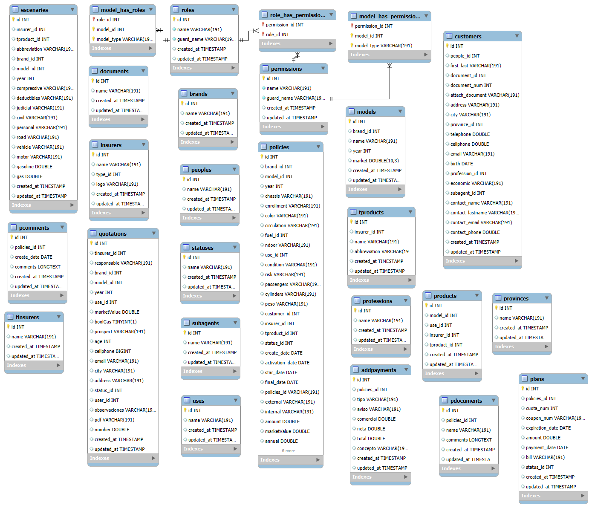
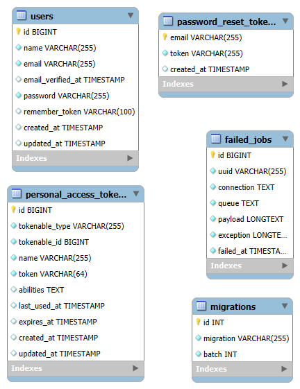

# **Название проекта**

Краткое описание проекта, его цели и основные возможности

Ссылки на репозитории сервера и клиента

---

## **Содержание**

1. [Архитектура](#Архитектура)
	1. [C4-модель](#C4-модель)
	2. [Схема данных](#Схема_данных)
2. [Функциональные возможности](#Функциональные_возможности)
	1. [Диаграмма вариантов использования(#Диаграмма_вариантов_использования)]
	2. [User-flow диаграммы](#User-flow_диаграммы)
3. [Детали реализации](#Детали_реализации)
	1. [UML-диаграммы](#UML-диаграммы)
	2. [Спецификация API](#Спецификация_API)
	3. [Безопасность](#Безопасность)
	4. [Оценка качества кода](#Оценка_качества_кода)
4. [Тестирование](#Тестирование)
	1. [Unit-тесты](#Unit-тесты)
	2. [Интеграционные тесты](#Интеграционные_тесты)
5. [Установка и  запуск](#installation)
	1. [Манифесты для сборки docker образов](#Манифесты_для_сборки_docker_образов)
	2. [Манифесты для развертывания k8s кластера](#Манифесты_для_развертывания_k8s_кластера)
6. [Лицензия](#Лицензия)
7. [Контакты](#Контакты)

---
## **Архитектура**

### C4-модель



### Схема данных

### Main DB (MySQL)



### Auth DB (MySQL)


---

## **Функциональные возможности**

### Диаграмма вариантов использования

Диаграмма вариантов использования и ее описание

### User-flow диаграммы

Описание переходов между части ПС для всех ролей из диаграммы ВИ (название ролей должны совпадать с тем, что указано на c4-модели и диаграмме вариантов использования)


---

## **Детали реализации**

### UML-диаграммы

Представить все UML-диаграммы , которые позволят более точно понять структуру и детали реализации ПС

### Спецификация API

Файл спецификации Open API (для сервиса Swagger):
#### [Файл swagger.yaml](swagger.yaml)

### Безопасность

В проекте реализованы следующие подходы к обеспечению безопасности:

1. Аутентификация и авторизация: Используется надежная система аутентификации пользователей с поддержкой многофакторной аутентификации. Доступ к различным разделам приложения ограничен на основе ролей и прав, что позволяет контролировать, кто может выполнять определенные действия.

2. Шифрование данных: Все конфиденциальные данные, такие как пароли и личная информация пользователей, хранятся в зашифрованном виде. Это защищает данные от несанкционированного доступа даже в случае утечки базы данных.

3. Защита от CSRF-атак: Реализована защита от межсайтовых подделок запросов (CSRF) путем использования уникальных токенов для форм, что предотвращает выполнение нежелательных действий от имени пользователя без его ведома.

4. Валидация и фильтрация входных данных: Все входные данные проходят строгую валидацию и фильтрацию, чтобы предотвратить атаки, такие как SQL-инъекции и XSS. Это обеспечивает защиту от вредоносных данных и скриптов.

5. Логирование и мониторинг: Ведется журналирование всех действий пользователей и системных событий, что позволяет отслеживать подозрительную активность и быстро реагировать на возможные инциденты безопасности.

6. Регулярные обновления и патчи: Система регулярно обновляется для устранения уязвимостей и применения последних патчей безопасности, что минимизирует риски, связанные с известными угрозами.

7. Ограничение доступа по IP: Реализовано ограничение доступа к административным разделам приложения по IP-адресам, что добавляет дополнительный уровень защиты от несанкционированного доступа.

Эти меры позволяют значительно повысить уровень безопасности приложения и защитить данные пользователей от различных угроз.
### Оценка качества кода

В проекте реализованы следующие подходы к обеспечению качества кода:

1. Код-ревью: Каждый коммит проходит через процесс код-ревью, где другие разработчики анализируют изменения. Это помогает выявить ошибки, улучшить читаемость и предложить лучшие подходы к решению задач.

2. Автоматизированное тестирование: Внедрены юнит-тесты и интеграционные тесты, которые автоматически проверяют функциональность кода. Это позволяет быстро обнаруживать и исправлять ошибки при внесении изменений.

3. Стандарты кодирования: Определены и задействованы стандарты кодирования, которые обеспечивают единообразие в написании кода. Это включает в себя правила по именованию переменных, форматированию и структуре файлов.

4. Документирование кода: Код сопровождается комментариями и документацией, что облегчает понимание его логики и структуры. Используются инструменты для генерации документации из исходного кода.

5. Статический анализ кода: Применяются инструменты статического анализа, которые помогают выявлять потенциальные проблемы, такие как утечки памяти, неиспользуемые переменные и другие дефекты до выполнения кода.

6. Непрерывная интеграция и доставка (CI/CD): Реализован процесс непрерывной интеграции, который автоматически собирает и тестирует код при каждом изменении. Это позволяет быстро выявлять и устранять проблемы.

7. Рефакторинг: Регулярно проводится рефакторинг кода для улучшения его структуры и производительности без изменения функциональности. Это помогает поддерживать код в чистом и понятном состоянии.

8. Обратная связь от пользователей: Собирается обратная связь от пользователей и тестировщиков, что позволяет выявлять проблемные области и улучшать качество кода на основе реального опыта использования.

Эти меры способствуют поддержанию высокого качества кода, что в свою очередь улучшает стабильность и производительность приложения.


---

## **Тестирование**

### Unit-тесты

#### Тестирование доступности аутентификации через Facede функциональность аутентификации на Laravel
```php
private function doAuth()
{
	$user = (object)$this->fetchItem(1);
	$model = new \App\User();
	$model->id = $user->id;
	$model->name = $user->name;
	$model->email = $user->email;
	\Illuminate\Support\Facades\Auth::login($model);
}
```

#### Тестирование доступности списка брендов в админке
```php
    public function testBrandsControllerModel()
    {
        $this->doAuth();

        $datas = Brands::all();
        $viewCustom =  view('admin.parameters.brands.index')->with('datas', $datas);
        $this->assertEquals($viewCustom, (new BrandsController())->index());
    }
```

#### Тестирование доступности сценариев страхования в админ панели
```php
    public function testEscenariesControllerModel()
    {
        $this->doAuth();

        $datas = Escenaries::leftJoin('insurers', function($join){
            $join->on('escenaries.insurer_id', '=', 'insurers.id');
        })
            ->leftJoin('tproducts', function($join){
                $join->on('escenaries.tproduct_id', '=', 'tproducts.id');
            })
            ->leftJoin('brands', function($join){
                $join->on('escenaries.brand_id', '=', 'brands.id');
            })
            ->leftJoin('models', function($join){
                $join->on('escenaries.model_id', '=', 'models.id');
            })
            ->select('escenaries.*', 'insurers.name as insurername', 'tproducts.name as tproductname', 'brands.name as brandname', 'models.name as modelname')
            ->get();
        $viewCustom =  view('admin.parameters.escenaries.index')->with('datas', $datas);
        $this->assertEquals($viewCustom, (new EscenariesController())->index());
    }
```


#### Тестирование работы модели (сущности) продукта (объекта) строхования
```php

    public function testProductModel()
    {
        $products = \App\Models\Products::query()->get();;

        $this->assertNotEquals($products->count(), 0);
        $this->assertNotNull($products->first()->model_id);
        $this->assertNotNull($products->first()->created_at);
        $this->assertNotNull(\App\Models\Models::find($products->first()->model_id));
    }
```

#### Тестирование доступности страховщиков
```php

    public function testSubagentsControllerModel()
    {
        $this->doAuth();

        $datas = Subagents::all();
        $viewCustom =  view('admin.configuration.subagents.index')->with('datas', $datas);
        $this->assertEquals($viewCustom, (new SubagentsController())->index());
    }
```

### Интеграционные тесты

#### Примеры тестирования доступности ПС
```php
    public function testLogin()
    {
        $response = $this->get('/login');

        $response->assertStatus(200);
    }

    public function testMain()
    {
        $response = $this->get('/');

        $response->assertStatus(302);
    }

    public function testAdmin()
    {
        $response = $this->get('/admin/users');

        $response->assertStatus(302);
    }

```

---

## **Установка и  запуск**

### Шаги по установке и запуску проекта

#### Шаг 1 - переменные окружения
Заполнить все env-файлы проекта на основе .env.example файлов: 
`./.env`, `./cw-insurance-jwt-service/.env`,  `./cw-insurance-main-service/.env`.

#### Шаг 2 - монтирование докер-образов, установка зависимостей
```shell
docker-compose build 
```
```shell
docker-compose run --rm pt_composer install
```
```shell
docker-compose run --rm jwt_composer install
```

#### Шаг 3 - БД
Выполнить миграции

```shell
docker-compose run --rm pt_artisan migrate
```
```shell
docker-compose run --rm jwt_artisan migrate
```
или же импортировать данные в обе БД через phpmyadmin, по адресам:
`http://localhost:8093` и `http://localhost:8094`

#### Шаг 4 - запуск проекта

```shell
docker-compose up -d 
```
Проект запущен, можно работать!

---

## **Лицензия**

Этот проект лицензирован по лицензии MIT - подробности представлены в файле [License.md]

---

## **Контакты**

Автор: `user@mail.ru`
